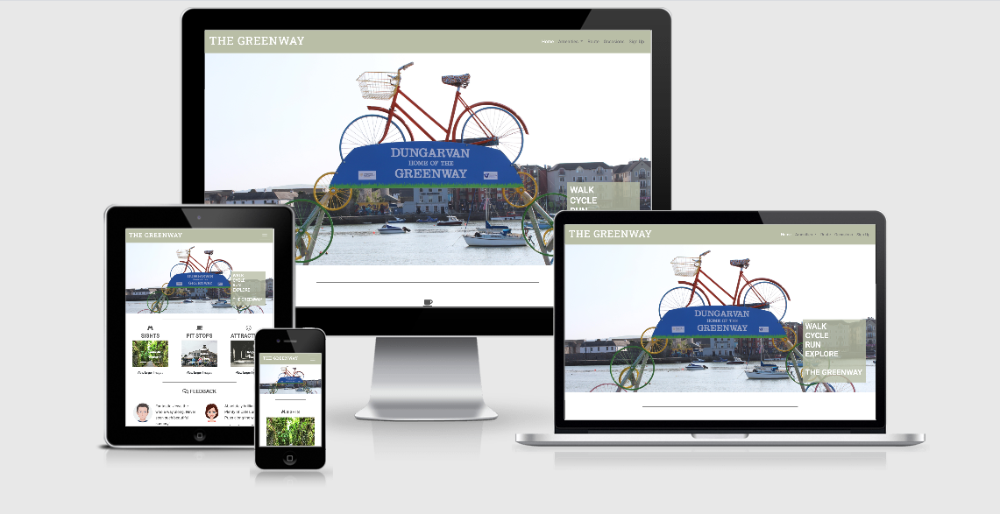

<h1>Walk, Run, Cycle, Explore - THE GREENWAY</h1>

**<h2>Introduction</h2>**

The picturesque Waterford Greenway hugs the coastline as it 
follows old railway lines 46km long from lively Waterford City, through the 
foothills of the Comeragh Mountains and onto the pretty harbour town 
of Dungarvan. You can walk part of the way, cycle in both directions 
or cycle one way and get the bus back to Waterford from Dungarvan.

The Greenway website aims to provide users with all the knowledge they
need or require of all the Sights, Attractions and Amenities available to 
them along the way. 

The website can be viewed on Desktop, Tablet and Mobile devices. Click <a href="https://bar-dev.github.io/Greenway">here</a> to view.

**<h2>Table of Content</h2>**

<ol>
    <li>UX</li>
        <ul style="list-style-type:circle;">
            <li>Goals</li>
            <ul style="list-style-type:disc;">
                <li>Greenway Goals</li>
                <li>Customer Goals</li>
                <li>Business Goals</li>
            </ul>
            <li>User Stories</li>
            <ul style="list-style-type:disc;">
                <li>Fitness & Well-Being</li>
                <li>The Potential Customer</li>
                <li>The UX Designer</li>
            </ul>
            <li>Design</li>
            <ul style="list-style-type:disc;">
                <li>Colors</li>
                <li>Font</li>
            </ul>
            <li>Wireframes</li>
        </ul>
    <li>Features</li>
        <ul style="list-style-type:circle;">
            <li>Existing Features</li>
            <li>Features left to implement</li>
            <li>Plans for Future Fixes</li>
        </ul>
    <li>Technologies</li>
    <li>Deployment</li>
    <li>Testing</li>
    <li>Credits</li>
</ol>