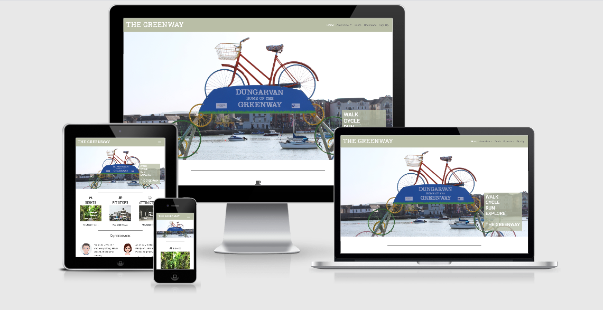
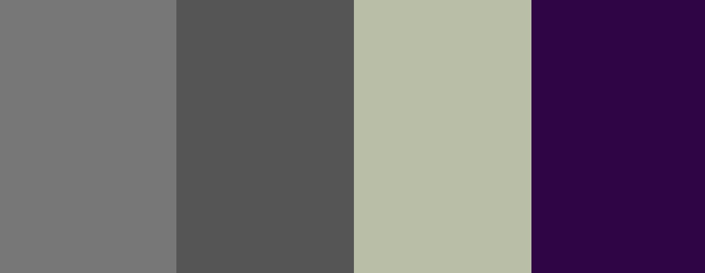

# Walk, Run, Cycle, Explore - THE GREENWAY

## Introduction

The picturesque Waterford Greenway hugs the coastline as it 
follows old railway lines 46km long from lively Waterford City, through the 
foothills of the Comeragh Mountains and onto the pretty harbour town 
of Dungarvan. You can walk part of the way, cycle in both directions 
or cycle one way and get the bus back to Waterford from Dungarvan.

The Greenway website aims to provide users with all the knowledge they
need or require of all the Sights, Attractions and Amenities available to 
them along the way. 

The website can be viewed on Desktop, Tablet and Mobile devices. Click <a href="https://bar-dev.github.io/Greenway">here</a> to view.

## Table of Contents

1.  [UX](#ux)
    * [Goals](#goals)
        * [Greenway Goal](#greenway-goals)
        * [Customer Goals](#customer-goals)
        * [Business Goals](#business-goals)
    * [User Stories](#user-stories)
        * [Tourism](#tourism)
        * [The Potential Customer](#the-potential-customer)
        * [The Business Customer](#the-business-customer)
        * [The UX Design](#the-ux-design)
    * [Design](#design)
        * [Colors](#colors)
        * [Font](#font)            
     * [Wireframes](#wireframes)           
2.  [Features](#features)
    * [Existing Features](#existing-features)
    * [Features left to implement](#features-left-to-implement)
    * [Plans for Future Releases](#plans-for-future-releases)
3.  [Technologies](#technologies)
4.  [Testing](#testing)
5.  [Deployment](#deployment)
6.  [Credits](#credits)
7.  [Disclaimer](#disclaimer)
    
## 1. UX

### Goals

#### Greenway Goals

The goal of The Greenway website is to be a fully functional and informative tourism website providing clear understanding 
about what is available to the user in terms of Sights and Amenities all the way along their journey.

**Target audience is:**

* Cycling enthusiasts
* Walking enthusiasts
* Running enthusiasts
* National Tourists
* Over-seas Tourists

#### Customer Goals

* Awareness of The Greenway Route
* Guidance on popular Attractions on the Route
* Guidance on popular Sights and their locations on the Route
* Guidance on Bike Hire locations
* Guidance on Cafes & Pubs on the Route

#### Business Goals

* Fully functional website
* Ease of navigation
* Intuitive design
* Promotion of local businesses
* Promotion of loacl activities

All goals are addressed through user stories

### User Stories

#### Tourism

**As a Tourism Website I want my website to:**

* be an attractive first impression on opening.
* immediately show what the website is about.
* display simple navigational technologies.
* have a strong focus on mobile usability.
* have minimal user information stored.
* display clear high resolution images.
* be usable for both right and left handed users.
* allow users to engage with us through social media channels.

#### The Potential Customer

**As a customer I want:**

* the website to be easy navigational.
* the website to inform me of relevant information about The Greenway.
* the website to be easy to use especially on mobile devices.
* to be informed of different seasonal activities.
* to know where I can find all relevant Amenities.
* to be able to navigate easily back to the Home page.

#### The Business Customer

**As a business owner I want:**

* quickly evaluate what benefit the website has for my business.
* to see clear, precise information on where to find my business.
* to see my business displayed clearly and informatively on mobile devices also.
* to see that potential users of the website are informed of upcoming events.

#### The UX Designer

**As a UX Designer I want:**

* to track user behaviour to monitor areas that may improve the user experience.
* to make sure the user has good experience on mobile devices as the website will be used on the go.
* to get user feedback on different aspects of the site.
* to provide local opportunities for businesses.
* to provide easy navigation for customers to find local businesses and Amenities.

### Design

#### Colors

The following colors have formed the main design of the website:

**List of colors used are:**
* #555555 Davys Grey
* #777777 Sonic Silver
* #b9bea5 Laurel Green
* #2F0147 Russian Violet

The predominant color used for this website was Laurel Green. This was chosen to provide a nice neutral atmosphere and to blend with the various images 
used by adjusting the opacity of this color to various depths.

#### Fonts

The main font used for this website was **Roboto** with **Sans Serif** as a backup font. Apart from the main logo text which was **Roboto Slab** to give
the title matching style to the font style on the main image of the Home page.

Font weights used were:
* 300
* 400
* 600

### Wireframes

With the help of [figma](https://www.figma.com/) I produced mockups of the proposed website starting with a mobile first approach.

Links to the mockups can be found [here](https://www.figma.com/file/0RxmmzdVcdvmkA27svyg0z/Greenway?node-id=0%3A1) where you will find the full design 
proposal for each page. I tried my best to adhere to the inital proposal only changing things if seen as an additional improvement to the overall
website.

If you cannot access the mockups via the link above you can view them [here](https://github.com/Bar-Dev/Greenway/tree/master/documentation/wireframes)

## 2. Features

### Existing Features

#### Home Page

* **Layout and Style**
    * I wanted the website to give an immediate feel of where the location of the Greenway was as well as a nice light smooth visual approach. I feel the choice of image used
    on the Home page achieves both of these requirements. I added text boxes into the images on each main page to give that extra bit of information so
    that users know what the website is about from the start. 
    * I kept the amount of text used to a minimum in order to provide the information to the users through a more visual approach and just using text where appropriate. The 
    combination of limited text and visual images allowed for me to design the site in a way that uses all retail space of the site as best I could and not having any blank areas 
    on any pages. 
    * Careful detail was applied to the responsiveness of the site to further ensure all retail space sized correctly and not leaving any blank areas.

* **Navigation Bar**
    * The navigation bar has a fixed position on all pages to allow for easy constant use. 
    * On small screen widths the navbar items reduce to a toggler icon that provides them with a dropdown list when clicked.
    * The Laurel Green color was used on the navbar to keep in touch with the overall theme of the Greenway.
    * The "Sign Up" button on the Navbar allows users to sign up to the website with their email in order to receive a monthly newsletter about all 
    upcoming activities.

* **Footer**
    * Contact information: 
        * The "Business" contact button provides a popup Modal allowing business owners to contact me about advertisement.
        * The "Public" contact button provides a popup Modal allowing them to provide their own Feedback on the Greenway.
    * Download Links provide the user with a downloadable version of all the Cafe's or Bike Hire shops in PDF format that they can either save to their
    device or print out.
    * Social section provides links to all relevant social media sites (currently linked to login pages of each)
    * All clickable text or icons on the footer section change to Russian Violet color when hovered over.

* **Carousels**
    * The Home page consists of three carousels relating to different aspects of the Greenway. As the size of the carousels will get smaller on some screens 
    I have provided a clickable text button under each one that brings up a Modal with a larger carousel of the same images.

* **Feedback**
    * I have provided a Feedback section to the Home page so users can see first hand information from others of their experiences.

#### Amenities

**Cafe's**
* The Cafe page provides a visual list of all local Coffee shops and pubs that have signed up to the website.
* Addresses and contact details are also provided under the images.
**Bike Hire**
* The Bike Hire page provides a visual list of all local Bike Hire shops that have signed up to the website.
* Addresses and contact details are also provided under the images.

#### Route

* The Route page displays a map of the full Greenway route from Dungarvan to Waterford.
* I have implemented numbered icons to the map that once clicked provide the user with a popup Modal with an image of what they can expect to find
at that location.
* On hover the icons turn to Laurel Green with the text turning to White.

#### Occasions

* The Occasions page consists of two video boxes allowing the user to Play and Pause the video.
* The user can also adjust the volume of the audio from within the video boxes.

### Features left to implement

* Different Languages - While the website is full of visual information I would still like to be able to implement a list of countries so the website would display 
all text in a language native to that country. 
* Tracking - I would like to install analytical tools to properly monitor what pages the users are most frequently visiting to help provide this data to businesses
* Feedback - I would like to expand on the current feedback section. The current Modal does not send the information anywhere at present. I would like to have a much more 
expandable section allowing users feedback to be published straight on the website.

### Plans for future releases

* Cafe's and Bike Hire Shops - I would like to add links to the lists of individual shops that once clicked provide you with the exact location on a popup map
of the shop you are trying to find.
* Social Media - The current social media links are only general links to login pages. I want to have relevant information on those links further expanding The Greenway
information.
* Feedback - I want to expand the feedback section so the businesses can have their own relevant feedback for their own premises.

## 3. Technologies

### Languages

* HTML - base language for this project.
* CSS - used for styling the HTML code.
* JavaScript - used with Bootstrap for Modals

### Libaries

* [Bootstrap](https://getbootstrap.com/) - used for responsive grid system, styling and modals.
* [FontAwseome](https://fontawesome.com/) - used for all icons on the site.
* [Google Fonts](https://fonts.google.com/) - used for the Pacifico fonts.
* [Favicon.io](https://favicon.io/) - used for creating a favicon.

### Tools

* [Gitpod](https://www.gitpod.io) - used as IDE for this project.
* [Git](https://git-scm.com/) - used for version control.
* [Github](https://github.com/) - used to host repository and live website.
* [Figma](https://www.figma.com/) - used for creation of mockups.
* [Am I Responsive](http://ami.responsivedesign.is/) - used for testing purposes as well as creating the image to display the web pages on different devices.
* [Google Chrome DevTools](https://developers.google.com/web/tools/chrome-devtools) - used for testing and debugging.
* [w3 html validator](https://validator.w3.org/) - used to test and validate my html code.
* [w3 css validator](https://jigsaw.w3.org/) - used to test and validate my css code.
* [Free Formatter](https://www.freeformatter.com/) - used to format my html, css and javascript code.
* [Coolors](http://coolors.co/) - used to test colour combinations.

## 4. Testing

Full documentation of all testing can be viewed [here](https://github.com/Bar-Dev/Greenway/tree/master/testing.md)

## 5. Deployment

A live demo of the website can be reached [here](https://bar-dev.github.io/Greenway)

This web app was developed in Gitpod and pushed to the remote repository, GitHub. The live page is hosted on GitHub Pages. 

**Used commands during deployment:**
* `git add .` - to add the files to the staging area.
* `git commit -m "text message here"` - to commit the files.
* `git push` - to push to origin master branch on to GitHub.
* `git status` - to see the current status of the files.

### Hosting on GitHub Pages

* Log into GitHub.
* From the list of repositories choose [The Greenway](https://github.com/Bar-Dev/Greenway).
* Go to settings.
* Scroll down to GitHub Pages section.
* Select as a source **master branch**.
* The page is now automatically refreshed and the project is deployed.
* To access the project scroll down again to GitHub Pages section and click on the provided link.

For more detailed information regarding deployment to GitHub Pages click [here](https://pages.github.com/).

## 6. Credits

### Content

All content in this web app was written by me.

### Media

**Images**
   * [Waterford Greenway Bike Hire](https://www.waterfordgreenwaybikehire.com/)
   * [The Park Hotel](https://www.parkhoteldungarvan.com/waterford-greenway.html)
   * [The Irish Times](https://www.irishtimes.com/life-and-style/travel/ireland/waterford-s-46km-greenway-opens-for-cyclists-and-walkers-1.3022201)
   * [Nire Valley Eco Camp](https://nirevalleyecocamp.com/waterford-greenway-bike-hire/)
   * [Outsider.ie](https://outsider.ie/ireland/waterford-greenway/)
   * [USI.ie](https://usi.ie/waterford-city-night-view/)
   * [Irish Cycle](https://irishcycle.com/2016/11/08/review-images-waterford-greenway/waterford-greenway-ballyvoyle-tunnel-2/)
   * [Deise Greenway](https://www.facebook.com/deise.greenway/?hc_ref=ARQP6-oj4Su7JsDCeZf7mrUEBj4BDpJlfvKaKpvvRfhJb_HOkt2H1RMqUbIpL8hdp_0&fref=nf&__tn__=kC-R)
   * [Bizlocator](https://bizlocator.ie/listings/omahonys-bar-shop/)
   * [Coach House Coffee](https://www.coachhousecoffee.ie/)
   * [CNN](https://edition.cnn.com/2019/06/03/health/coffee-heart-health-arteries-scli-intl-gbr/index.html)

**Videos**
   * [Daithi Ó Raghallaigh](https://www.youtube.com/watch?v=YCWfeD84XSo&feature=youtu.be)
   * [Deise Greenway](https://www.facebook.com/deise.greenway/)

### Acknowledgements

#### Tutorials

* [Code Institute](https://codeinstitute.net/) - I used a lot of the course content to help me building my site

#### Pages used for information

* [W3schools](https://www.w3schools.com/)
* [W3C](https://www.w3.org/)
* [Stack overflow](https://stackoverflow.com/)
* [CSS-Tricks](https://css-tricks.com/)

#### I received advice and encouragement from
   * Seun Owonikoko (Mentor)
   * JimLynx (Slack Webinars and Forum help)
   * Kamil Zok (Slack Forum help)
   * Anthony (Slack Forum Help)
   * Laimo (Slack Forum Help)

## 7. Disclaimer: 
This project is for educational purposes only, no materials/files are intended for any commercial use. 
In this document all sources will be credited.

