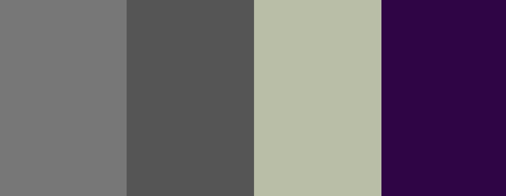

# Walk, Run, Cycle, Explore - THE GREENWAY

## Introduction

The picturesque Waterford Greenway hugs the coastline as it 
follows old railway lines 46km long from lively Waterford City, through the 
foothills of the Comeragh Mountains and onto the pretty harbour town 
of Dungarvan. You can walk part of the way, cycle in both directions 
or cycle one way and get the bus back to Waterford from Dungarvan.

The Greenway website aims to provide users with all the knowledge they
need or require of all the Sights, Attractions and Amenities available to 
them along the way. 

The website can be viewed on Desktop, Tablet and Mobile devices. Click <a href="https://bar-dev.github.io/Greenway">here</a> to view.

## Table of Contents

1.  [UX](#ux)
    * [Goals](#goals)
        * [Greenway Goal](#greenway-goals)
        * [Customer Goals](#customer-goals)
        * [Business Goals](#business-goals)
    * [User Stories](#user-stories)
        * [Tourism](#tourism)
        * [The Potential Customer](#the-potential-customer)
        * [The Business Customer](#the-business-customer)
        * [The UX Design](#the-ux-design)
    * [Design](#design)
        * [Colors](#colors)
        * [Font](#font)            
     * [Wireframes](#wireframes)           
2.  [Features](#features)
    * [Existing Features](#existing-features)
    * [Features left to implement](#features-left-to-implement)
    * [Plans for Future Releases](#plans-for-future-releases)
3.  [Technologies](#technologies)
4.  [Deployment](#deployment)
5.  [Testing](#testing)
6.  [Credits](#credits)
    
## 1. UX

### Goals

#### Greenway Goals

The goal of The Greenway website is to be a fully functional and informative tourism website providing clear understanding 
about what is available to the user in terms of Sights and Amenities all the way along their journey.

**Target audience is:**

* Cycling enthusiasts
* Walking enthusiasts
* Running enthusiasts
* National Tourists
* Over-seas Tourists

#### Customer Goals

* Awareness of The Greenway Route
* Guidance on popular Attractions on the Route
* Guidance on popular Sights and their locations on the Route
* Guidance on Bike Hire locations
* Guidance on Cafes & Pubs on the Route

#### Business Goals

* Fully functional website
* Ease of navigation
* Intuitive design
* Promotion of local businesses
* Promotion of loacl activities

All goals are addressed through user stories

### User Stories

#### Tourism

**As a Tourism Website I want my website to:**

* be an attractive first impression on opening.
* immediately show what the website is about.
* display simple navigational technologies.
* have a strong focus on mobile usability.
* have minimal user information stored.
* display clear high resolution images.
* be usable for both right and left handed users.
* allow users to engage with us through social media channels.

#### The Potential Customer

**As a customer I want:**

* the website to be easy navigational.
* the website to inform me of relevant information about The Greenway.
* the website to be easy to use especially on mobile devices.
* to be informed of different seasonal activities.
* to know where I can find all relevant Amenities.
* to be able to navigate easily back to the Home page.

#### The Business Customer

**As a business owner I want:**

* quickly evaluate what benefit the website has for my business.
* to see clear, precise information on where to find my business.
* to see my business displayed clearly and informatively on mobile devices also.
* to see that potential users of the website are informed of upcoming events.

#### The UX Designer

**As a UX Designer I want:**

* to track user behaviour to monitor areas that may improve the user experience.
* to make sure the user has good experience on mobile devices as the website will be used on the go.
* to get user feedback on different aspects of the site.
* to provide local opportunities for businesses.
* to provide easy naviagtion for customers to find local businesses and Amenities.

### Design

#### Colors

The following colors have formed the main design of the website:

**List of colors used are:**
* #555555 Davys Grey
* #777777 Sonic Silver
* #b9bea5 Laurel Green
* #2F0147 Russian Violet

The prodominent color used for this website was Laurel Green. This was choosen to provide a nice neutral atmosphere and to blend with the various images 
used by adjusting the opacity of this color to various depths.

#### Fonts

The main font used for this website was **Roboto** with **Sans Serif** as a backup font. Apart from the main logo text which was **Roboto Slab** to give
the title matching style to the font style on the main image of the Home page.

Font weights used were:
* 300
* 400
* 600

### Wireframes

